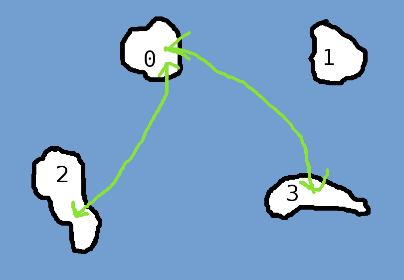

#### _Telerik Academy Season 2016-2017 / C# Advanced Exam - 31 May 2016_

# Penguin airlines

## Description

You don't know where your infinite set of grandparents live, do you? After all, you never go visit them. Let me tell you, they live on some of the Antarctic islands.  
From time to time, they go see each other (they are not like you). Since your family has heard of Titanic, they travel only by plane, using the Penguin airlines.


There are **N** islands (numbered **from 0 to N-1**). For each one of the islands there may be some regular flights which will be given as input.

Why do you care? Well, these elderly people are your family. They know you control the power of **daInternetO** and you can check flights quicker than them. So they will constantly ask you how to get from island **A** to island **B**. You are going to have to robotize yourself. It is good that **daInternetO** introduced you to computer programming. Write a program which answers for each query if there is a flight and if it is a direct one or not (see Output).

## Input
- On the first line you will receive an integer **N**
- The next **N** lines represent the outgoing flights for island **0**, **1**, ..., **N-1**
  - Island numbers will be separated by a single space
  - If for some island there are no flights the string `None` will be given
- Each of the next lines will contain the numbers **A** and **B** separated by spaces for each query
  - When all queries are read the string `Have a break` will be given
- _The input will always be valid and in the described format. There is no need to validate it explicitly._

## Output
- For each query you should output one of these strings
  - `No flights available.` - when there is no way to make the trip
  - `There is a direct flight.` - when there is a direct flight
  - `There are flights, unfortunately they are not direct, grandma :(` - when but it is possible to make the trip using multiple flights, but not directly
- Each answer should be on a separate lines
- Answer should be given in the same order as the queries

## Constraints
- If there is a flight from island **A** to **B** then there will be flight from **B** to **A**
  - **A** != **B** for each flight
- **A** != **B** for each query
- 2 <= **N** <= 10000
- 0 <= **total number of existing flights** <= 10000
- 1 <= **number of queries** <= 10000
- **Time limit: 0.1 s**
- **Memory limit: 32 MB**

## Sample tests

### Sample Test 1

#### Input
```
4
2 3
None
0
0
0 2
2 1
0 3
3 2
Have a break
```

#### Output
```
There is a direct flight.
No flights available.
There is a direct flight.
There are flights, unfortunately they are not direct, grandma :(
```

#### Explanation
```
There are 4 islands: 0, 1, 2 and 3
From 0 you can get to 2 and 3
From 1 you can't go anywhere
From 2 you can go to 0
From 3 you can go to 0
```

Here is an overly descriptive and very colorful diagram of the above example:



### Sample Test 2

#### Input
```
10
1 4 5
0 2
1 5
7
0 8
0 2
8 9
3
4 6 9
6 8
2 9
2 8
0 3
7 4
8 6
Have a break
```

#### Output
```
There are flights, unfortunately they are not direct, grandma :(
There are flights, unfortunately they are not direct, grandma :(
No flights available.
No flights available.
There is a direct flight.
```

### Sample Test 3

#### Input
```
15
2 3 7 11 12
2 3 4 6 12 13
0 1 8 10 14
0 1 13
1 8 11 12 14
9
1 7 13 14
0 6 8 12 14
2 4 7
5
2 13 14
0 4
0 1 4 7 14
1 3 6 10 14
2 4 6 7 10 12 13
1 3
2 5
11 9
11 13
9 6
3 7
7 5
1 6
0 11
1 4
Have a break
```

#### Output
```
There is a direct flight.
No flights available.
No flights available.
There are flights, unfortunately they are not direct, grandma :(
No flights available.
There are flights, unfortunately they are not direct, grandma :(
No flights available.
There is a direct flight.
There is a direct flight.
There is a direct flight.
```
